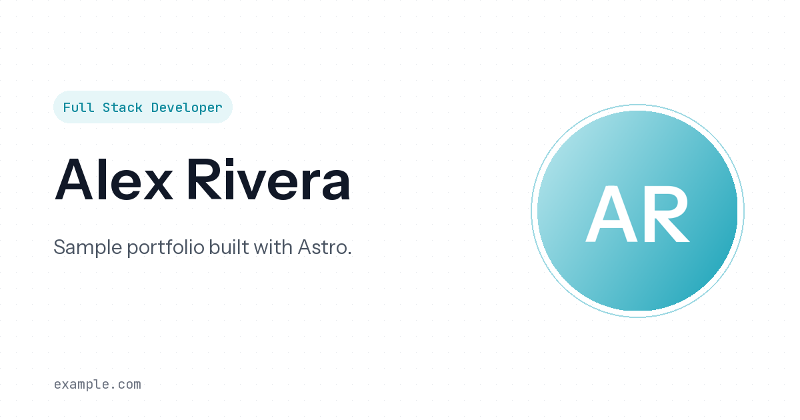

# Haris Wahyudi — Portfolio

[](https://www.haris.my.id)

Source code for my personal portfolio at **[haris.my.id](https://www.haris.my.id)**.

Static site built with [Astro](https://astro.build). No client framework: the only JavaScript is a few KB of vanilla JS for project filters, count-up numbers, the nav caret, and "read more".

## Run locally

Requires Node.js 18.20.8, 20.3+, or 22+.

```bash
npm install
npm run dev      # http://localhost:4321
npm run build    # static site in dist/
npm run check    # type-check .astro files
```

`dist/` can be deployed to any static host (Vercel, Netlify, Cloudflare Pages, Firebase Hosting).

## Editing content

All content lives in `src/data/`, so updating the site needs no component changes.

| File | What it holds |
|---|---|
| `profile.json` | Name, roles, social links, resume path, `careerStart` (drives every "X years" figure), and the company marquee |
| `jobs.json` | Work experience. `start`/`end` are `[year, month]`; omit `end` for a current role. Optional `clients` lists clients won through that role |
| `education.json` | Education rows. Optional `highlights` renders extra bullet points (for example a thesis) |
| `projects.json` | Projects. `type` is `"WEB"` or `"MOBILE"` and drives the filter tabs. Optional `cta` overrides the live-link button label |
| `skills.json` | Skills tree. The `since` year is turned into years of experience automatically |
| `testimonials.json` | Recommendations. Avatars live in `public/assets/testimonials/` |

Years of experience and current-job durations are computed at build time and refreshed in the browser, so they stay correct without a rebuild.

## Assets

Everything is self-hosted from `public/`; the page makes no requests to other domains.

| Path | What |
|---|---|
| `public/assets/` | Avatar, company and school logos, testimonial avatars, OG image |
| `public/projects/` | Project screenshots (`.webp`, matching `img` in `projects.json`) |
| `public/techstack/` | Tech icons (`<icon>.webp`, matching `icon` in `skills.json`) |
| `public/fonts/` | Instrument Sans and JetBrains Mono (variable woff2, declared in `global.css`) |
| `public/cv/` | Resume PDF (`resume` in `profile.json`) |

## Performance notes

- Loader, role rotator, orbit, marquee, and hover effects are pure CSS, with no JavaScript render loops.
- Scroll reveal uses CSS scroll-driven animations (`animation-timeline: view()`), with a single IntersectionObserver as fallback.
- Icons are inline SVG, so no icon font is downloaded.
- Images have explicit sizes plus `loading="lazy"` and `decoding="async"`. Only the avatar is loaded eagerly.
- The loader shows once per session (sessionStorage).
- `prefers-reduced-motion` turns off the loader, orbit, marquee, and reveal animations.

## Reusing this code

You're welcome to learn from the code or use it as a starting point for your own site. If you do, please replace everything in `src/data/` and the personal files in `public/` (listed below) before deploying. Don't publish a copy of this site with my name, résumé, or client work on it.

## License

The **source code** (components, layouts, styles, scripts, and config) is released under the [MIT License](LICENSE).

The **content** is not covered by the MIT License and remains © Haris Wahyudi, all rights reserved. That includes:

- All text and data in `src/data/`
- My photo, résumé, and OG image (`public/assets/avatar.*`, `public/assets/og-image.png`, `public/cv/`)
- Project screenshots in `public/projects/`
- Testimonial avatars in `public/assets/testimonials/`

Company, school, and technology logos are trademarks of their respective owners. The fonts in `public/fonts/` are licensed under the SIL Open Font License.
