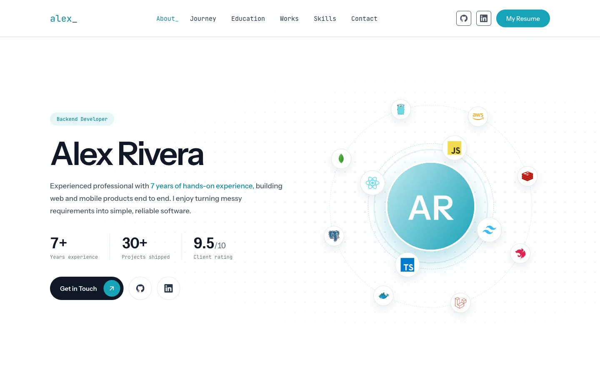

# Astro Developer Portfolio



A fast, static developer portfolio built with [Astro](https://astro.build). No client framework: the only JavaScript is a few KB of vanilla JS for project filters, count-up numbers, the nav caret, and "read more".

This branch ships with **sample data** for a fictional developer, Alex Rivera. See it running with real content at **[haris.my.id](https://www.haris.my.id)**.

## Run locally

Requires Node.js 18.20.8, 20.3+, or 22+.

```bash
npm install
npm run dev      # http://localhost:4321
npm run build    # static site in dist/
npm run check    # type-check .astro files
```

`dist/` can be deployed to any static host (Vercel, Netlify, Cloudflare Pages, Firebase Hosting).

## Make it yours

1. Edit the JSON files in `src/data/` (table below). Start with `profile.json`: it sets your name, brand, site URL, SEO title, and social links.
2. Replace the sample images in `public/assets/` and `public/projects/`, and put your résumé in `public/cv/`.
3. Run `npm run build` and deploy `dist/`.

| File | What it holds |
|---|---|
| `profile.json` | Name, `brand` (header logo), `site` URL, `seo` title/description, OG image, roles, social links, résumé path, `careerStart` (drives every "X years" figure), and the company marquee |
| `jobs.json` | Work experience. `start`/`end` are `[year, month]`; omit `end` for a current role. Optional `clients` lists clients won through that role |
| `education.json` | Education rows. Optional `highlights` renders extra bullet points (for example a thesis) |
| `projects.json` | Projects. `type` is `"WEB"` or `"MOBILE"` and drives the filter tabs. Optional `cta` overrides the live-link button label |
| `skills.json` | Skills tree. The `since` year is turned into years of experience automatically |
| `testimonials.json` | Recommendations. Leave `avatar` empty to show the person's initial instead |

Years of experience and current-job durations are computed at build time and refreshed in the browser, so they stay correct without a rebuild.

## Assets

Everything is self-hosted from `public/`; the page makes no requests to other domains.

| Path | What |
|---|---|
| `public/assets/` | Avatar and OG image |
| `public/assets/logos/` | Company and school logos |
| `public/projects/` | Project screenshots (`.webp`, matching `img` in `projects.json`) |
| `public/techstack/` | Tech icons (`<icon>.webp`, matching `icon` in `skills.json`) |
| `public/fonts/` | Instrument Sans and JetBrains Mono (variable woff2, declared in `global.css`) |
| `public/cv/` | Résumé PDF (`resume` in `profile.json`) |

## Performance notes

- Loader, role rotator, orbit, marquee, and hover effects are pure CSS, with no JavaScript render loops.
- Scroll reveal uses CSS scroll-driven animations (`animation-timeline: view()`), with a single IntersectionObserver as fallback.
- Icons are inline SVG, so no icon font is downloaded.
- Images have explicit sizes plus `loading="lazy"` and `decoding="async"`. Only the avatar is loaded eagerly.
- The loader shows once per session (sessionStorage).
- `prefers-reduced-motion` turns off the loader, orbit, marquee, and reveal animations.

## Branches

- `main`: the code with sample data. Fork or clone this one.
- `personal`: my own site content, deployed to haris.my.id. Code changes land on `main` first and are merged into `personal`.

## License

The source code and the sample content on `main` are released under the [MIT License](LICENSE).

The content on the `personal` branch (text, photos, résumé, project screenshots, testimonials, and client logos) is **not** covered by the MIT License and remains © Haris Wahyudi, all rights reserved. Please don't republish it.

Technology logos in `public/techstack/` are trademarks of their respective owners. The fonts in `public/fonts/` are licensed under the SIL Open Font License.
